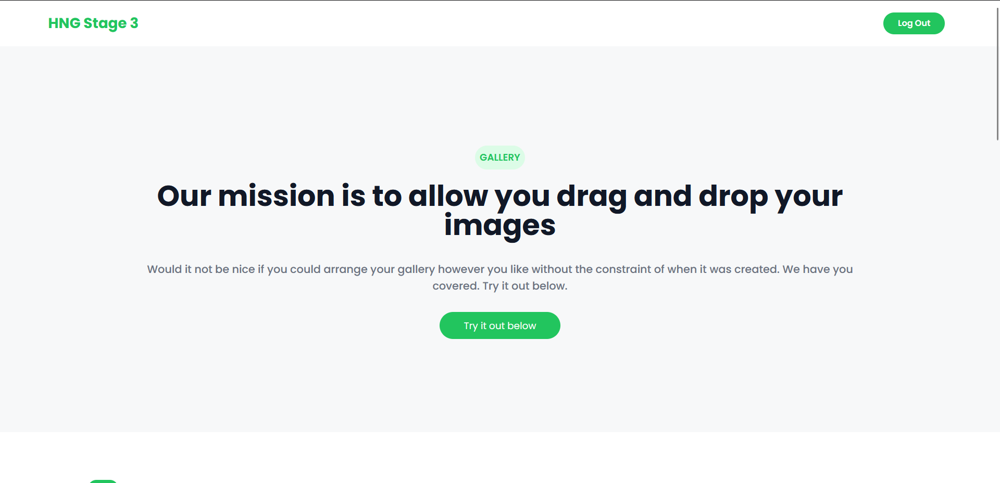

# HNG Stage three task

## Task

Develop a Drag-and-Drop Image gallery using React or Next Js

## Objectives
You will implement a fully functional and responsive image gallery that showcases a collection of images in a visually appealing way.
A user should be able to Login to the gallery page. Authenticated users should be able to use the Drag-and-Drop feature, they should be able to select and drag images, effortlessly rearranging them within the gallery.

## Requirement
- Simple Authentication
- Image Display
- Loading state
- Search Functionality
- Drag and Drop
- User-friendly feedback
- Responsive Design
- Design flexibilty 

## Getting Started

To get started with this project, follow these steps:

1. Clone the repository to your local machine:

2. Navigate to the project directory:

3. Install the required dependencies:
   npm install

4. Start the development server:
   npm run dev to start the development server

## Login Credentials

Before accessing the main page, you need to log in with the following credentials:

- Email: user@example.com
- Password: 1Password

## Technologies Used

- React
- Next Js
- Tailwind CSS
- @dnd-kit/core

## Screenshot

## Available Features

- Login
- Drag and Drop
- Filter by Tags

## Live Demo

[Live Demo Link](https://dropndrag.netlify.app/)

## Author

- Github: [@salskhal](https://github.com/salskhal)
- Twitter: [@salskhal](https://twitter.com/salskhal)