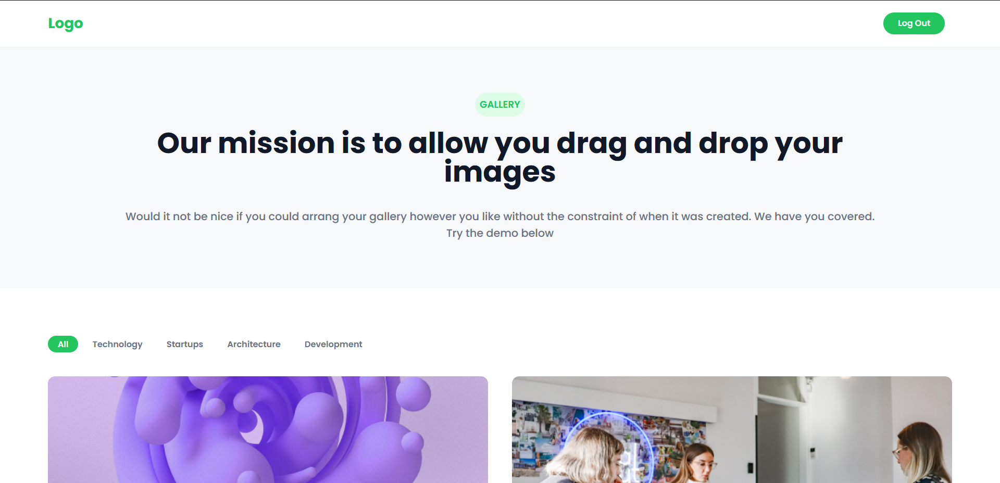
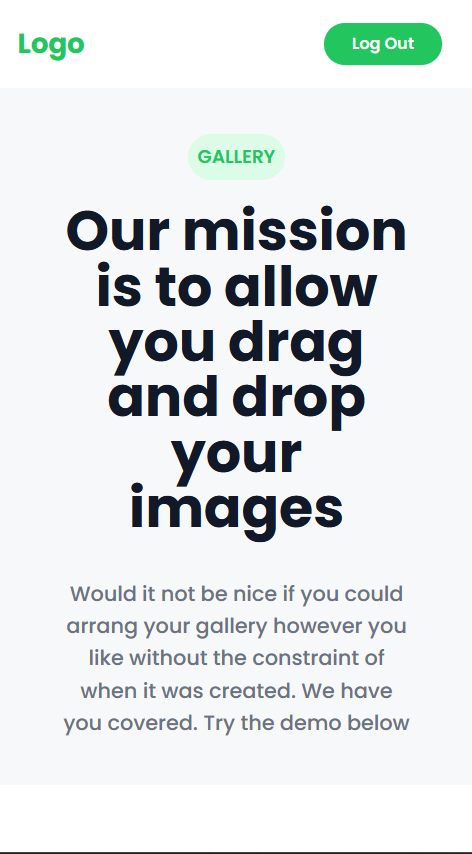

# HNG Stage three task

<!-- add image -->

## Task

Develop a Drag-and-Drop Image gallery using React or Next Js

## Objectives
You will implement a fully functional and responsive image gallery that showcases a collection of images in a visually appealing way.
A user should be able to Login to the gallery page. Authenticated users should be able to use the Drag-and-Drop feature, they should be able to select and drag images, effortlessly rearranging them within the gallery.

## Requirement
- Simple Authentication
- Image Display
- Loading state
- Search Functionality
- Drag and Drop
- User-friendly feedback
- Responsive Design
- Design flexibilty 

## Instructions to run Locally

- Clone the repo
- Go to the directory
- Run "npm install" to install all the dependencies
- You are live

